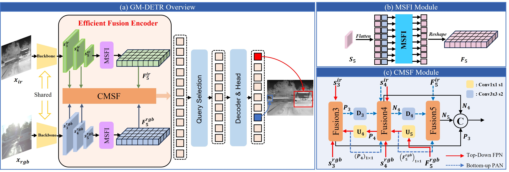

## Intro
Official Code for [GM-DETR: Generalized Muiltispectral DEtection TRansformer with Efficient Fusion Encoder for Visible-Infrared Detection](https://openaccess.thecvf.com/content/CVPR2024W/JRDB/html/Xiao_GM-DETR_Generalized_Muiltispectral_DEtection_TRansformer_with_Efficient_Fusion_Encoder_for_CVPRW_2024_paper.html).

## Abstract
Multispectral object detection based on RGB and IR achieves improved accurate and robust performance by integrating complementary information from different modal-
ities. However, existing methods predominantly focus on effectively fusing information from both modalities to enhance detection performance, and rarely study the diver-
sified utilization of RGB and IR data and explore the adaptability of the model to practical application scenarios. We first analyze the utilization of datasets for multi-
spectral object detection, and compare their testing performance. To better leverage datasets and address more generalized model application scenarios, we propose a Gener-
alized Multispectral DEtection TRansformer (GM-DETR) with a two-stage training strategy. Specifically, we design the Modality-Specific Feature Interaction (MSFI) mod-
ule to extract the high-level information from RGB and IR, and propose the Cross-Modality-Scale feature Fusion (CMSF) module for fusing RGB and IR modalities, which performs multi-scale cross-modalities fusion. Our GM-DETR achieves state-of-the-art performance on FLIR and LLVIP benchmark datasets.

## Overview
<div align="left">

</div>


## Dataset

Please refer to the instructions on this work for downloading the FLIR and [LLVIP](https://github.com/bupt-ai-cz/LLVIP) datasets.

https://github.com/DocF/multispectral-object-detection/blob/main/README.md

You need to convert all annotations to COCO format.

Refer: https://github.com/PaddlePaddle/PaddleDetection/blob/release/2.7/docs/tutorials/data/PrepareDetDataSet.md


The FLIR dataset and LLVIP dataset should be organized as:
```
GM-DETR
└── data
    ├── FLIR
    │   ├── annotations
    │          ├── algn_flir_train_class3_ir.json
    │          ├── algn_flir_train_class3_rgb.json
    │          ├── algn_flir_train_class3_merge.json
    │          ├── algn_flir_val_class3_ir.json
    │          ├── algn_flir_val_class3_rgb.json
    |          └── algn_flir_val_class3_merge.json
    │   ├── data_ir
    |   |      |—— FLIR_00002_PreviewData.jpeg
    |   |      └── FLIR_00003_PreviewData.jpeg
    │   └── data_rgb
    |          |—— FLIR_00002_RGB.jpg
    |          └── FLIR_00003_RGB.jpg
    │
    └── LLVIP
        ├── annotations
        │      ├── LLVIP_train_class1_ir.json
        │      ├── LLVIP_train_class1_rgb.json
        │      ├── LLVIP_train_class1_merge.json
        │      ├── LLVIP_val_class1_ir.json
        │      ├── LLVIP_val_class1_rgb.json
        |      └── LLVIP_val_class1_merge.json
        ├── data_ir
        |      |—— 010001.jpg
        |      └── 010002.jpg
        └── data_rgb   
               |—— 010001.jpg
               └── 010002.jpg
```
## Installation 
It is recommended to use Python version 3.8 and follow the [PaddleDetection installation guide](https://github.com/PaddlePaddle/PaddleDetection/blob/release/2.7/docs/tutorials/INSTALL.md) for installation.

```
# paddlepaddle==2.4.2, CUDA==11.6, cuDNN=8.4.0
python3 -m pip install paddlepaddle-gpu==2.4.2.post116 -f https://www.paddlepaddle.org.cn/whl/linux/mkl/avx/stable.html

# Clone PaddleDetection repository
git clone https://github.com/yiming-shaw/GM-DETR

# Install other dependencies
cd GM-DETR
pip install -r requirements.txt

# Compile and install GM-DETR
pip install -v -e .

```

## Run
The details for training, testing, and inference can be found in the documentation of [Paddledetection](https://github.com/PaddlePaddle/PaddleDetection/blob/release/2.7/docs/tutorials/GETTING_STARTED.md).

The [RT-DETR](https://github.com/lyuwenyu/RT-DETR) baseline of the Align FLIR dataset

train 
```
CUDA_VISIBLE_DEVICES=0 python tools/train.py -c configs/rtdetr/rtdetr_hgnetv2_x_5x_align_flir_v1_ir_class3.yml --eval
```

val
```
CUDA_VISIBLE_DEVICES=0 python tools/eval.py -c configs/rtdetr/rtdetr_hgnetv2_x_5x_align_flir_v1_ir_class3.yml \
-o weights=output/___/best_model.pdparams
```

infer
```
CUDA_VISIBLE_DEVICES=0 python tools/infer.py -c configs/rtdetr/rtdetr_hgnetv2_x_5x_align_flir_v1_ir_class3.yml \
--infer_img=images/$img_name \
--output_dir=/infer_output_ir \
--draw_threshold=0.5 \
-o weights=output/___/best_model.pdparams
```

[GM-DETR](https://openaccess.thecvf.com/content/CVPR2024W/JRDB/html/Xiao_GM-DETR_Generalized_Muiltispectral_DEtection_TRansformer_with_Efficient_Fusion_Encoder_for_CVPRW_2024_paper.html)

train (Isolation stage)
```
CUDA_VISIBLE_DEVICES=0 python tools/train.py -c configs/gmdetr/gmdetr_hgnetv2_x_5x_align_flir_v1_ir_X_class3_train1.yml --eval
```

train (Fusion stage) 
```
CUDA_VISIBLE_DEVICES=0 python tools/train.py -c configs/gmdetr/gmdetr_hgnetv2_x_5x_align_flir_v1_ir_X_class3_train2.yml --eval \
-r output/gmdetr_hgnetv2_x_5x_align_flir_v1_ir_X_class3_train1/9.pdparams
```

val (fusion)
```
CUDA_VISIBLE_DEVICES=0 python tools/eval.py -c configs/gmdetr/gmdetr_hgnetv2_x_5x_align_flir_v1_ir_X_class3_train2.yml \
-o weights=output/gmdetr_hgnetv2_x_5x_align_flir_v1_ir_X_class3_train2/best.pdparams
```

val (modality drop)
```
CUDA_VISIBLE_DEVICES=0 python tools/eval.py -c configs/gmdetr/gmdetr_hgnetv2_x_5x_align_flir_v1_ir_X_class3_train2_test_rgb(ir).yml \
-o weights=output/gmdetr_hgnetv2_x_5x_align_flir_v1_ir_X_class3_train2/best.pdparams
```

infer
```
CUDA_VISIBLE_DEVICES=0 python tools/infer.py -c configs/gmdetr/gmdetr_hgnetv2_x_5x_align_flir_v1_ir_X_class3_train2.yml \
--infer_img=images/$img_name \
--output_dir=/infer_output_ir \
--draw_threshold=0.5 \
-o weights=output/___/best_model.pdparams
```

## Results

| Methods | Data    | mAP50 | mAP75 | mAP   | AP50  | AP75  | AP   |
|---------|---------|-------|-------|-------|-------|-------|------|
|         |         |       |  FLIR |       |       | LLVIP |      |
| RT-DETR | RGB     | 69.7  | 26.5  | 33.5  | 91.5  | 59.5  | 54.2 |
| RT-DETR | IR      | 80.5  | 39.6  | 43.6  | 97.3  | 78.4  | 67.9 |
| GM-DETR (fus) | RGB+IR | 83.6 | 42    | 45.3  | 97.5  | 80.6  | 69.6 |
| GM-DETR (iso+fus) | RGB+IR | **83.9** | **42.6** | **45.8** | 97.4 | **81.4** | **70.2** |


#### References
https://github.com/PaddlePaddle/PaddleDetection/tree/release/2.7

https://github.com/lyuwenyu/RT-DETR

## Citation
If you use this repo for your research, please cite our paper:
```
@InProceedings{Xiao_2024_CVPR,
    author    = {Xiao, Yiming and Meng, Fanman and Wu, Qingbo and Xu, Linfeng and He, Mingzhou and Li, Hongliang},
    title     = {GM-DETR: Generalized Muiltispectral DEtection TRansformer with Efficient Fusion Encoder for Visible-Infrared Detection},
    booktitle = {Proceedings of the IEEE/CVF Conference on Computer Vision and Pattern Recognition (CVPR) Workshops},
    month     = {June},
    year      = {2024},
    pages     = {5541-5549}
}
```